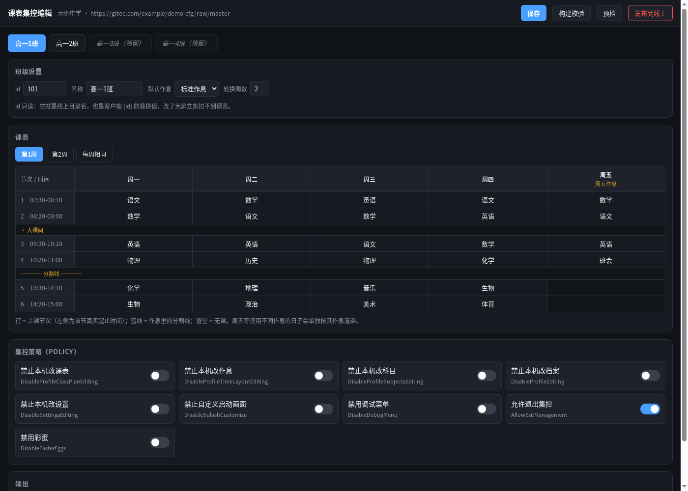
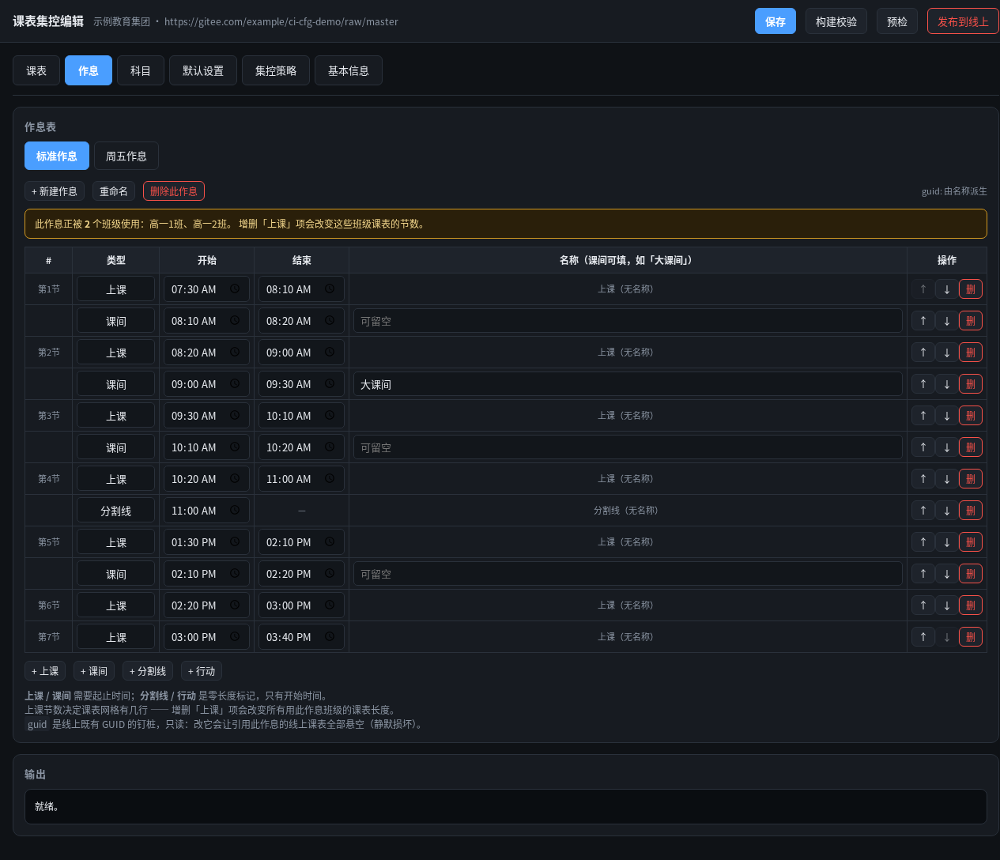

# ClassIsland Server

[ClassIsland](https://github.com/ClassIsland/ClassIsland) 集控（管理服务器）的可视化课表管理工具与静态配置生成器。

通过维护一份 YAML，或在 Web 界面中完成编辑，即可生成整套集控静态文件并发布至 Gitee、GitHub 或任意静态托管环境。无需独立服务端、数据库，也无需前端构建工具链。



作息时间表编辑界面：



---

## 背景

ClassIsland 集控支持无服务端模式（`ServerKind: 0`）：将若干 JSON 静态文件部署至任意可公开访问的位置（Gitee raw、GitHub raw、对象存储、自建 Nginx 等），客户端即可获取统一下发的配置。

手工维护这些 JSON 存在以下问题：

- 每个班级对应一份 `classplans.json`，课程条目以 GUID 关联，班级数量较多时维护成本高；
- 作息时间表与科目为多班级共享资源，任何变更都必须保证所有班级的引用仍然有效；
- 客户端仅在 `manifest.json` 中的 `Version` 整数**增大**时才会重新下载配置。内容发生变化而 `Version` 未递增时，客户端不会更新，且不提供任何错误提示。

本项目将上述流程自动化，并在发布前执行安全校验。

## 功能特性

- **按班级独立的作息时间表与科目（v1.2.0）**：作息与科目按班级分别下发，支持为每个班级单独配置任课教师。
- **Web 可视化编辑**：课表以表格形式呈现（行为节次并标注真实起止时间，列为星期），科目通过下拉框选择；集控策略以开关面板管理。
- **完整的档案 Web 管理**：支持在界面中维护作息时间表（节次、课间、分割线的增删与时间调整）、自定义科目、客户端默认设置、组织名称与发布地址，无需手工编写 YAML。
- **作息变更联动课表**：新增或删除「上课」节次时，自动同步调整所有引用该作息的班级课表，避免因节数不一致导致无法保存。
- **装机预设下载**：可直接下载 `ManagementPreset.json`，放入客户端程序目录后即可自动接入集控。
- **轻量部署**：基于 Python 标准库与 PyYAML 实现的单文件 HTTP 服务，无需 npm 或前端构建链。
- **多周轮换**：支持 `mon@1` / `mon@2` 语法及任意周数轮换；在 Web 界面切换到指定周次并编辑某一天即可自动拆分，列头提供一键合并回「每周相同」的操作。
- **按日指定作息**：可针对单个日期指定不同作息，适用于周五提前放学、周日晚自习等场景。
- **版本号自动管理**：基于内容哈希自动递增 `Version`，避免内容更新后客户端不生效。
- **发布前安全校验**：检查悬空引用、文件覆盖影响与 `Version` 单调性，校验不通过将终止发布。
- **既有配置迁移**：可将线上已有的人工维护配置反向导入为 YAML，使生成结果为既有配置的超集，而非直接覆盖。
- **客户端档案导入**：在 Web 界面直接上传 ClassIsland 客户端导出的 `Default.json`，指定班级 id 后自动拆分为作息/科目/课表并写入 YAML，GUID 原样保留，校验通过即可发布；也可用 `tools/import_default.py` 命令行操作。
- **YAML 最小改动写入**：保存时仅重写实际变更的 YAML 段，其余内容保持字节不变；`guid:` 钉桩、警示注释及条目上方的手写说明均原样保留。
- **确定性输出**：相同输入始终生成相同字节内容，便于通过 git diff 审查变更。
- **预留班级**：可预先占用班级 id 而暂不排课，且不会生成空课表导致客户端显示空白。

## 快速开始

提供三种发布包，按目标机器情况选择：

| 发布包 | 体积 | 适用 |
| --- | --- | --- |
| `classisland-server-<版本>-windows-x64.zip` | 约 50 MB | Windows x64，**Python 和 Git 都内置，真正零安装** |
| `classisland-server-<版本>-linux-x64.tar.gz` | 约 19 MB | glibc Linux x86_64，内置 Python（git 一般系统自带） |
| `classisland-server-<版本>.zip`（纯源码） | 约 0.4 MB | 已装 Python 3.9+ 与 git 的任意平台（含 macOS） |

便携包已内置 Python 运行时（`runtime/`）与纯 Python 版 PyYAML（`vendor/`）。下载并解压对应发布包后：

- **Windows**：双击运行 `start-webui.bat`（后台启动、无控制台窗口、自动打开默认浏览器；停止服务运行 `stop-webui.bat`，日志在 `logs\webui.log`；需要前台看日志可用 `start-webui.bat debug`）
- **Linux / macOS**：执行 `./start-webui.sh`

启动脚本会优先使用包内 `runtime/` 的解释器；纯源码包则回退到系统 Python 3.9+。两种包都**无需联网、无需 `pip install`**（仅当你自行裁剪了 `vendor/` 又没用便携运行时时，才需 `pip install -r requirements.txt`）。默认端口为 `8848`，也可通过参数指定，例如 `./start-webui.sh 8000`。

> **关于 git**：首次使用向导的 clone 与「发布到线上」依赖 git。**Windows 便携包已内置无头版 MinGit**，开箱即可拉取/推送；Linux 便携包与源码包使用系统 git（Linux 一般自带，macOS 首次运行会提示安装 Xcode 命令行工具）。打开网页、编辑课表、本地生成/预览配置不依赖 git。

启动后在浏览器中访问 `http://localhost:8848`（Windows 便携包默认只监听本机回环地址，避免触发防火墙弹窗；Linux 默认监听所有网卡，内网可用 `http://<本机 IP>:8848` 访问。确需从局域网访问 Windows 实例时，可在命令后加参数 `--host 0.0.0.0`）。

首次运行流程如下：

1. 若工作目录中不存在 `schedule.yaml`，程序会自动以内置示例创建一份，可直接通过构建校验；
2. 点击页面右上角的「首次使用向导」，填入自行创建的公开仓库地址，向导将自动完成 clone、识别默认分支、计算客户端使用的 raw 发布地址并写回配置；
3. 在各页签中将示例数据修改为本校课表，点击「保存」；
4. 点击「发布到线上」完成发布。

如需跳过向导，也可手动完成初始化：

```bash
cp examples/schedule.example.yaml schedule.yaml
cp config.example.json config.json
python3 tools/webui.py
```

界面包含六个页签：

| 页签 | 可编辑内容 |
|---|---|
| 课表 | 新增与删除班级、按班级排课（行为节次并标注真实时间）、班级名称、默认作息、单日切换作息、任意周数轮换 |
| 作息 | 作息表的新建、重命名与删除，节次与课间的增删、时间调整、插入分割线 |
| 科目 | 维护官方 21 个科目之外的自定义科目（简称、任课教师、户外标记） |
| 默认设置 | 下发至客户端的默认设置（对应 `DefaultSettingsSource`） |
| 集控策略 | 通过 9 个开关锁定客户端本机的修改权限 |
| 基本信息 | 档案名称、组织名称、发布地址，以及装机预设下载 |

编辑完成后点击「保存」。系统会在写入前执行完整构建校验，校验不通过将拒绝写入；同时仅重写发生变更的 YAML 段，其余内容保持字节不变。

也可以仅使用命令行：

```bash
python3 src/split.py            # 生成集控文件树至 dist/
python3 tools/preflight.py --dist dist --live ./live-repo   # 发布前安全检查
```

## 配置

`config.json` 从 `config.example.json` 复制而来，不纳入版本管理：

| 键 | 说明 |
|---|---|
| `live_repo` | 目标发布仓库的本地克隆路径，发布时将变更写入该目录并执行 push |
| `backup_dir` | 备份目录，保存 YAML 及线上文件被覆盖前的副本。**设置为空字符串即关闭备份**（版本历史由目标仓库的 git 记录承担，备份仅为本地保险） |
| `git_exec_path` | 通常留空。仅在 Git 的 `--exec-path` 指向错误目录时需要配置（部分 NAS 套件版本的 Git 存在此问题，可能导致 HTTPS 传输不可用） |
| `git_branch` | 推送分支，默认 `master`。通过 Web 向导连接仓库时会自动探测远端默认分支并写回，通常无需手动配置 |
| `git_user_name` | 自动提交时使用的作者名称，默认 `classisland-server` |
| `git_user_email` | 自动提交时使用的作者邮箱，默认 `classisland-server@localhost` |

上述配置均可通过环境变量覆盖，对应变量名为键名添加 `CISRV_` 前缀，例如 `CISRV_LIVE_REPO`、`CISRV_BACKUP_DIR`、`CISRV_GIT_BRANCH`、`CISRV_GIT_USER_NAME`、`CISRV_GIT_USER_EMAIL`。

### 按班级配置任课教师

任课教师名称写在班级内部的 `subjects:` 段中，仅对该班级生效：

```yaml
classes:
  - id: "101"
    name: 高一1班
    timelayout: 标准作息
    subjects:                      # 仅影响当前班级
      数学: { teacher: 张老师 }
      语文: { teacher: 李老师 }
    schedule:
      mon: [语文, 数学, ...]
```

可用字段为 `teacher`、`initial`、`outdoor`。未识别的字段名将直接报错，不会被静默忽略，以避免配置未生效而难以察觉。

顶层的 `subjects:` 仍然保留，但用途不同：用于**声明官方 21 个科目之外的新科目**；班级内部的 `subjects:` 则用于**覆盖已有科目在该班级中的属性**。

## 部署到 Gitee / GitHub

1. 新建一个**公开**仓库，用于存放生成的配置文件（建议与本项目代码仓库分开）。该仓库必须公开：客户端拉取配置时不携带凭据，私有仓库将导致客户端无法获取配置。
2. 在 Web 界面的「首次使用向导」中填入该仓库地址，向导会自动 clone 至本地 `live-repo/` 目录并识别默认分支；也可以手动克隆后将路径填入 `config.json` 的 `live_repo`。
3. 向导会自动计算并写回 `publish.base_url`（也可在「基本信息」页签中手动修改）：
   - Gitee：`https://gitee.com/<用户>/<仓库>/raw/master`
   - GitHub：`https://raw.githubusercontent.com/<用户>/<仓库>/main`
4. 在 Web 界面点击「发布到线上」，或手动执行 `git push`。

**关于使用 raw 而非 Pages**：Gitee 免费版 Pages 每次更新后需要手动触发部署，无法纳入自动化流程；raw 地址在推送后即时生效（CDN 缓存时间约为 60 秒）。

在客户端「设置 → 集控」中填写 `manifest.json` 的完整地址，并将班级标识设置为 YAML 中定义的 `id`。

生成的配置仓库结构如下（自 v1.2.0 起，作息与科目按班级分别下发）：

```
manifest.json          集控入口（单份，URL 中的 {id} 由客户端自行替换）
policy.json            集控策略（全校统一）
101/classplans.json    课表
101/timelayouts.json   作息（仅包含该班级引用的部分）
101/subjects.json      科目（包含该班级的任课教师配置）
102/...
```

每个班级目录均为自包含结构：课表中引用的作息与科目必然可在同一目录下找到。发布前的安全检查会逐班级验证该约束。

### 批量装机：ManagementPreset.json

如不希望在每台客户端设备上手工填写服务器地址，可在 Web 界面「基本信息」页签下载 `ManagementPreset.json`，并放入客户端程序目录。ClassIsland 启动时会自动加载集控配置。文件中的 `ClassIdentity` 保持为空，由每台客户端设备在装机时填入对应的班级 id。

## 客户端配置更新机制

`manifest.json` 中的每个数据源都包含一个 `Version` 整数。客户端的判定逻辑为：

```
本地不存在该配置，或远端 Version > 本地 Version  →  下载
```

比较采用严格大于，因此：

- 内容变更时必须使 `Version` 增大，本项目通过内容哈希自动完成；
- `Version` 不允许回退，数值减小将导致客户端不再更新；
- 因而无需使用「版本化文件名」等缓存规避手段，URL 保持稳定即可。

> **注意：`Version` 为全局标量，不按班级区分。**
> 客户端本地仅保存 `ClassPlanVersion`、`TimeLayoutVersion`、`SubjectsVersion` 等标量。即使文件已按班级拆分，修改任意一个班级都会抬升全局 `Version`，导致所有班级重新拉取各自的配置。该行为不会引发错误，但请求量会随班级数量增加（详见 `docs/SCHEMA.md` §4.2.2）。

## 目录结构

```
start-webui.sh / .bat  启动脚本（优先用内置运行时，免安装）
stop-webui.bat         停止 Windows 后台服务（start-webui.bat 默认后台无窗口）
requirements.txt       第三方依赖清单（仅开发/自行裁剪 vendor 时需要）
vendor/                 内置的纯 Python PyYAML（跨平台，免安装）
src/
  appconfig.py    环境配置（路径、Git 参数、提交身份）
  repourl.py      仓库地址推导（URL → clone/raw 地址，纯函数实现）
  ci_schema.py    ClassIsland 数据结构常量与构造器
  vendor_bootstrap.py     内置依赖引导（vendor/ 与子进程 PYTHONPATH）
  build.py        YAML → 完整 Default.json（全部校验逻辑集中于此）
  split.py        YAML → 集控静态文件树及 Version 管理
  yaml_edit.py    按段改写 YAML（保留注释与紧凑写法）
  import_profile.py       客户端导出档案（Default.json）→ YAML 合并逻辑
tools/
  webui.py        Web 服务端（含首次使用向导接口）
  webui_bg.py     Windows 后台无窗口启动器（pythonw + 日志轮转 + pid）
  webui.html      Web 前端（单文件，无构建步骤）
  preflight.py    发布前安全检查
  prune_ids.py    清理已删除班级在线上仓库中的残留目录
  import_live.py  将线上既有配置反向导入为 YAML
  import_default.py       命令行导入客户端导出的 Default.json
  build_release.py         构建纯源码发布压缩包
  build_portable.py        构建内置 Python 的便携包（Windows/Linux）
  build_windows_bundle.py  构建可直接接入集控的 Windows 客户端整合包
docs/
  SCHEMA.md       实测得到的数据格式说明
reference/
  default-subjects.json   ClassIsland 内置的 21 个官方科目
```

## 设计原则

以下原则源自实际使用中的经验总结，修改代码时请遵循。

**校验逻辑集中实现。** 所有校验均位于 `build.py`，`split.py` 与 Web 界面统一调用，不重复实现，以避免多条代码路径的行为产生分歧。

**失败优先于静默错误。** 对无法确认的输入显式报错，例如无法识别的科目名会报错并给出最接近的合法名称；未排课且未标记 `reserved` 的班级会报错，而不是生成空课表导致客户端显示空白。

**GUID 确定性且可显式固定。** 常规情况下基于名称通过 `uuid5` 派生 GUID，以保证输出稳定；对于线上已有的历史 GUID，则通过 YAML 中的 `guid:` 字段显式固定。修改该字段会导致所有引用该作息的班级课表悬空。

**只写入，不删除。** `split.py` 不会删除线上文件，因为仓库中可能存在他人手工添加的目录。删除功能由独立工具 `prune_ids.py` 提供，默认为 dry-run。

**变更前备份。** 每次保存 YAML 及覆盖线上文件之前，均会自动备份至 `backup_dir`。

## 构建发布包

用于对外分发的压缩包仅包含程序与示例文件，不包含本机的 `config.json`、真实 `schedule.yaml`、`dist*/`、`live-repo/`、`backups/` 等内容：

```bash
# 纯源码包（约 0.4MB，要求目标机自带 Python 3.9+）
python3 tools/build_release.py                  # 输出至 release/classisland-server-<版本>.zip
python3 tools/build_release.py --format tar.gz  # 输出 tar.gz 格式

# 便携包（内置 Python 运行时，约 11MB Windows / 19MB Linux，免安装）
python3 tools/build_portable.py --prepare       # 首次：从 release/_runtime 归档展开/裁剪运行时
python3 tools/build_portable.py                 # 输出 *-windows-x64.zip 与 *-linux-x64.tar.gz
python3 tools/build_portable.py --only linux    # 只打一个平台
```

便携包的 Python 运行时是平台相关的原生二进制，**不随 git 分发**（`release/` 已被忽略）。打包前需把以下上游归档放到 `release/_runtime/`（版本与下载地址见 `tools/build_portable.py` 头部常量）：

- Windows：官方 [embeddable Python](https://www.python.org/ftp/python/)（`python-3.11.9-embed-amd64.zip`）
- Linux：[python-build-standalone](https://github.com/astral-sh/python-build-standalone) 的 `x86_64-unknown-linux-gnu install_only` 归档（可重定位、自带 OpenSSL；脚本会自动裁剪 pip/Tk/头文件等并 strip）
- Windows 额外：官方 [MinGit](https://github.com/git-for-windows/git/releases)（`MinGit-<版本>-64-bit.zip`，无头 Git，含 libcurl/OpenSSL/CA 证书），使 Windows 包零安装即可 clone/发布

打包前会执行脱敏检查：通用的本机绝对路径模式将被直接拦截；个人或私有词表（如姓名、私有仓库名）通过环境变量 `CISRV_PRIVATE_TERMS`（逗号分隔）提供，命中即终止打包。个人词表不写入源码，以避免在公开仓库中暴露私有命名。

此外提供面向客户端装机的 Windows 整合包构建脚本，可将官方客户端与入控预设合并打包，详见 `tools/build_windows_bundle.py` 文件头说明。

## 数据契约

`docs/SCHEMA.md` 记录了经实测得到的数据格式约定，包括 `StartTime` 与已废弃的 `StartSecond` 的关系、分割线的零长度语义、`WeekCountDiv` 轮换语义等。相关结论均来自程序集元数据分析，以及与客户端实际输出配置的逐字段比对。

## 兼容性

- 面向 ClassIsland **2.1.x**（`CoreVersion 2.0.0.0`）开发与验证。
- 已在真实客户端上完成验证：加载生成的配置后文件字节未被改写，界面渲染结果与预期逐字一致。

## 许可证

[GPL-3.0](LICENSE)

`reference/default-subjects.json` 中的官方科目定义提取自 ClassIsland（GPL-3.0），因此本项目采用相同的 GPL-3.0 许可证。

## 致谢

感谢 [ClassIsland](https://github.com/ClassIsland/ClassIsland) 及其作者。本项目为第三方配套工具，与上游官方不存在隶属关系。
